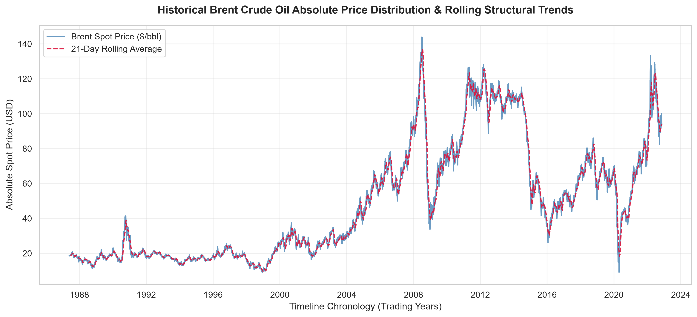
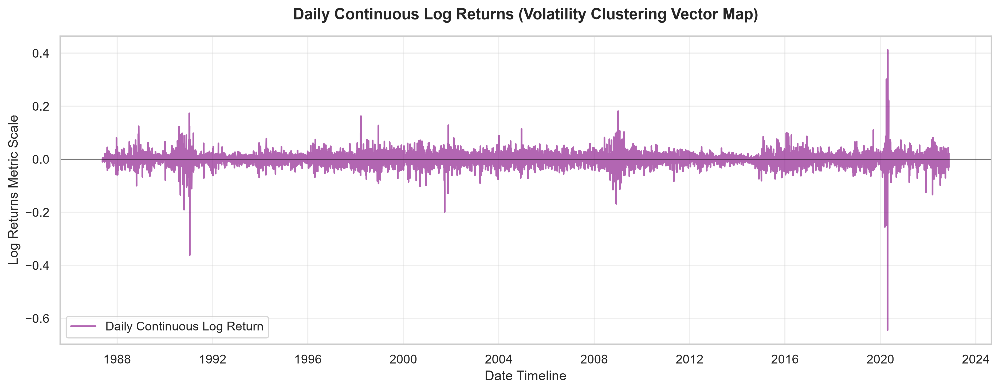

# 📊 Birhan Energies — Brent Crude Oil Quantitative Analytics Engine

An end-to-end data science and statistical pipeline built to analyze, model, and visualize the impact of major geopolitical conflicts, economic sanctions, and OPEC policy changes on historical Brent Crude Oil prices. 

This repository implements rigorous Exploratory Data Analysis (EDA), stationarity transformations, dynamic Bayesian Change Point Detection using Markov Chain Monte Carlo (MCMC) sampling, and exposes the resulting insights via a modular Flask REST API.

---

## 📈 Analytical Visualizations & Core Insights

The exploratory analysis automatically saves structural time-series insights into the `notebooks/Visuals/` assets folder. Below are the key baseline performance charts:

### 1. Absolute Price & Moving Trends
Shows the raw historical spot price distribution against a 21-day rolling trading average to track macro cycles.


### 2. Continuous Log Returns (Volatility Clustering Vector Map)
Visualizes daily log returns centering the mean tightly around zero, proving that the transformation successfully satisfied stationarity for modeling.


---

## 📂 Repository Architecture

The project enforces a strict separation of concerns across data parsing, statistical modeling, visual asset generation, and interactive presentation views:

```text
birhan-energies-analytics/
├── .github/workflows/
│   └── unittests.yml          # CI pipeline validation automation script
├── .vscode/
│   └── settings.json              # Local workspace Python interpreter mapping
├── data/
│   └── raw/                       # Local storage folder for raw BrentOilPrices.csv
├── notebooks/
│   ├── exploratory_analysis.ipynb # Interactive EDA and stationarity validation
│   └── Visuals/                   # High-resolution chart assets generated by the analysis
├── src/
│   ├── __init__.py
│   ├── data_pipeline.py           # Ingestion, mixed-date cleaning, and ADF routines
│   ├── bayesian_model.py          # PyMC Bayesian change-point MCMC estimation engine
│   └── app.py                     # Flask backend API service routes provider
└── tests/
    └── test_pipeline.py           # PyTest test cases for data integrity checking
  ```


## Tech Stack & Dependencies
Core Language: Python 3.10+

Statistical Modeling: PyMC (v5) & PyTensor (Bayesian Inference Engines)

Time-Series Analysis: statsmodels (Augmented Dickey-Fuller diagnostics)

Data Processing: pandas, numpy

Data Visualization: matplotlib, seaborn

API Service Layer: Flask, Flask-CORS

Testing Infrastructure: pytest


## Execution Guide

1. Environment Setup & Dependency Ingestion
Initialize your local isolated Python virtual environment and pull down the complete package dependencies index:
```bash
# Create virtual environment
python -m venv .venv

# Activate the environment in Windows PowerShell
.venv\Scripts\Activate.ps1

# Upgrade pip and install all required analytical libraries
python -m pip install --upgrade pip
pip install -r requirements.txt
```
2. Ingest Data and Run Stationarity Tests
Place your raw BrentOilPrices.csv inside data/raw/ and execute the pipeline to resolve mixed date formatting, compute continuous log returns, and review Augmented Dickey-Fuller stationarity results:
```bash
python -m src.data_pipeline
```
3. Run Bayesian Change Point DiscoveryExecute the PyMC sampling block to run MCMC simulations, estimate structural shift parameters ($\tau$), and generate posterior probability charts:
```bash
python -m src.bayesian_model
```
4. Boot Up the Flask API Service
Spin up the local backend REST server to expose summary metrics, price series arrays, and historical event timelines:
```bash
python -m src.app
```
Once initialized, access your live API metrics at http://127.0.0.1:5000/api/v1/metrics/summary

## Automated Testing Validation
Continuous integration testing is configured via GitHub Actions. You can execute your local test suites manually by running:
```bash
python -m pytest tests/
```

---

## 📈 Analysis Workflow & Strategic Event Dataset

To isolate structural anomalies, the analysis pipeline feeds a curated timeline of major global events into the statistical models as a benchmarking layer. This event dataset serves as a foundational input for downstream pipelines:

1. **Pipeline Input:** The 11 events in this dataset map directly to the continuous log return arrays generated in `src/data_pipeline.py` to check for 3-sigma tail-risk outliers.
2. **Model Validation:** The identified change points ($\tau$) from `src/bayesian_model.py` are cross-referenced with these dates to evaluate how quickly prices react to real-world shocks.
3. **API Delivery:** Endpoints in `src/app.py` stream this matrix alongside live pricing information to let frontend dashboards construct interactive event timelines.

### Complete Reference Event Matrix:
| Event Date | Market Shock Event | Core Category | Macroeconomic / Structural Vector Impact |
| :--- | :--- | :--- | :--- |
| **1990-08-02** | Gulf War Outbreak | Geopolitical | Immediate crude supply disruptions and soaring volatility premiums. |
| **1997-11-27** | OPEC Jakarta Expansion | OPEC Policy | Quota hikes during the Asian Financial Crisis trigger demand destruction. |
| **2001-09-11** | September 11 Attacks | Geopolitical | Global aviation contractions prompt steep drops in jet fuel demand. |
| **2003-03-20** | Iraq War Invasion | Geopolitical | Long-term risk premiums introduced via Middle Eastern logistical bottlenecks. |
| **2008-07-11** | Global Financial Crisis Peak| Macroeconomic | Prices peak at $147/bbl before a major asset-bubble contraction. |
| **2011-02-15** | Arab Spring Outbreak | Geopolitical | Civil unrest halts Libyan sweet crude output, spiking spot premiums. |
| **2014-11-27** | OPEC Market Share War | OPEC Policy | Shift to high-volume output creates a multi-year supply glut. |
| **2018-11-04** | US Iran Sanctions | Geopolitical | Re-imposition of secondary sanctions curtails international export volumes. |
| **2020-03-06** | OPEC+ Alliance Breakdown | OPEC Policy | Brief price war between top producers floods the physical market. |
| **2020-03-11** | COVID-19 Pandemic | Macroeconomic | Global lock-downs cause an unprecedented transport fuel demand shock. |
| **2022-02-24** | Russia-Ukraine War | Geopolitical | Major trade re-routing and widespread structural risk premiums. |

For detailed information regarding statistical validations, please refer to the complete [Assumptions and Limitations Framework](docs/assumptions_limitations.md).